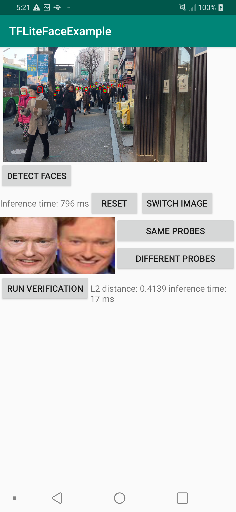

## Android face detection and recognition example using TensorFlow-Lite

Ported models:

- Detection: [RetinaFace](https://github.com/deepinsight/insightface/tree/master/RetinaFace#retinaface-face-detector)
- Recognition: [MobileFaceNet (trained using ArcFace)](https://github.com/deepinsight/insightface)

Requirements

- [Android OpenCV (tested version: 3.4.3)](https://opencv.org/android/)
